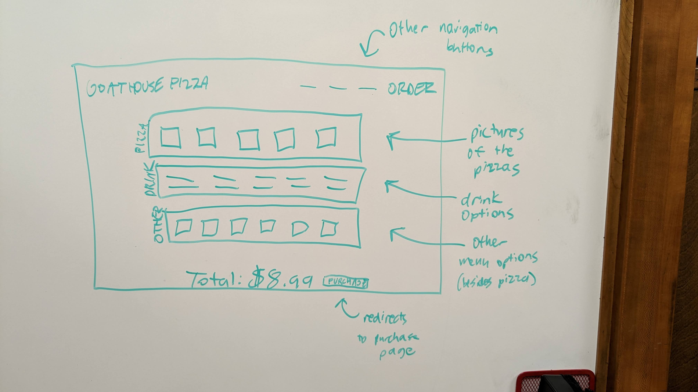

# Startup project for BYU CS260 - Winter 2023

## Elevator Pitch

Have you ever wanted to try truly fresh pizza from a homemade brick oven? Well now you can. Using our website, you can order online and select all the toppings and further customization you desire. Visit our site today and order a custom homemade pizza, or let our algorithm choose one for you based how adventurous you're feeling today and any dietary restrictions all at a low price!

## Design

## Key Features

* Ability to sign in and have the website remember your usual order
* Ability to opt out of signing in and continue as guest (which doesn't grant full access to features)
* Algorithm that, based on a couple questions, recommends something
* Order information is securely stored as well as account information
* Record of the order and transaction is stored and sent to business owners
* Order and time is placed on business owner's Google Calendar
